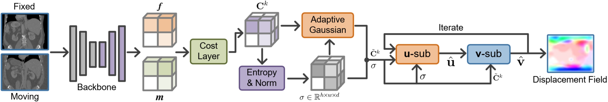
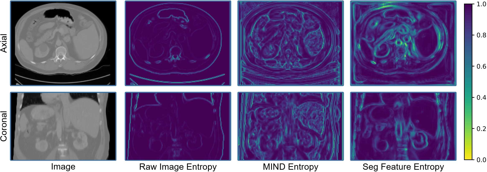

# VoxelOpt

<p align="center">
  
</p>

<p align="center">
  <a href="https://papers.miccai.org/miccai-2025/1010-Paper3887.html"></a>
  <a href="https://github.com/tinymilky/VoxelOpt"></a>
  
  
</p>

Official implementation of **VoxelOpt: Voxel-Adaptive Message Passing for
Discrete Optimization in Deformable Abdominal CT Registration**.

VoxelOpt is a training-free deformable registration method that combines
foundation-model features, local 3D cost volumes, voxel-wise displacement
entropy, and adaptive message passing. It delivers competitive abdominal CT
registration accuracy without training a registration network on segmentation
labels.

## Why VoxelOpt

- **Training-free registration**: no registration-network training loop, no
  supervision labels during optimization.
- **Foundation features, discrete optimizer**: pre-softmax segmentation features
  make the local displacement search sharply informative.
- **Voxel-adaptive message passing**: uncertain voxels receive more neighbor
  information, while confident boundary voxels preserve strong local signals.
- **Fast 5-level pyramid solver**: the Table 1 setting uses `k=1`, 27-neighbor
  local search, 6 optimization steps, and 7-step scaling-and-squaring.

<p align="center">
  
</p>

## Main Result

Abdominal CT registration, averaged over the 42 ordered test pairs:

| Method | Dice (%) ↑ | HD95 ↓ | SDLogJ ↓ | Runtime |
| --- | ---: | ---: | ---: | ---: |
| Initial | 30.86 | 29.77 | - | - |
| Deeds | 53.57 | 20.08 | 0.12 | 110.1 s |
| RDP, semi-supervised | 58.77 | 20.07 | 0.22 | <1 s |
| **VoxelOpt** | **58.51** | **18.54** | **0.21** | **<1 s** |

This repository was verified on the released test split with:

```text
Dice:  58.46%
HD95:  18.62
SDLogJ: 0.218
```

Small differences are expected from GPU, PyTorch, and half-precision kernel
behavior.

## Installation

Create an environment with Python 3.9 or newer:

```bash
conda create -n voxelopt python=3.9 -y
conda activate voxelopt
```

Install PyTorch for your CUDA version from the official PyTorch selector, then
install the remaining dependencies:

```bash
pip install numpy scipy pandas nibabel
```

The code has been verified with PyTorch 2.7 and CUDA GPUs. CPU execution is
possible for feature extraction but is slow for full 3D volumes.

## Download Data

Download the preprocessed abdominal CT registration data from Dropbox:

```text
https://www.dropbox.com/scl/fo/1ri37zp2awc1e218p0zjx/AHw9tXM-wowNqT8WzG6Uq5c?rlkey=ppgyoll7vzzg6hgdz8uzt9h7q&st=drein7eg&dl=0
```

Place the extracted folder in the repository root and name it exactly:

```text
abdomenreg/
  img/
    img0001.nii.gz
    ...
    img0030.nii.gz
  label/
    label0001.nii.gz
    ...
    label0030.nii.gz
```

The released Table 1 evaluation uses subjects `0024` to `0030`, producing
`7 x 6 = 42` ordered test pairs. The feature extraction step below creates:

```text
abdomenreg/fea/img0024.npy ... img0030.npy
```

The pretrained feature extractor checkpoint is expected at:

```text
src/unet.pth
```

## Quick Start

Run all commands from the repository root.

### 1. Extract Foundation Features

```bash
python src/get_unet_features.py --data_path ./abdomenreg --split test --gpu_id 0 --overwrite
```

The script clips CT intensities to `[-500, 800]`, normalizes to `[0, 1]`, runs
the pretrained segmentation backbone, and saves feature maps under
`abdomenreg/fea/`.

### 2. Reproduce VoxelOpt Table 1

```bash
python src/test_abdomen.py --data_path ./abdomenreg --gpu_id 0
```

The output CSV is saved to:

```text
logs_abct/results_ks1_half1_ada1_foundation.csv
```

Expected final line:

```text
Avg val dice 0.58..., Avg hd95 18..., Avg std dev 0.21...
```

### 3. Optional Smoke Test

To check the environment before launching the full 42-pair run:

```bash
python src/test_abdomen.py --data_path ./abdomenreg --gpu_id 0 --max_pairs 1
```

This writes `logs_abct/results_ks1_half1_ada1_foundation_n1.csv` and does not
overwrite the full evaluation CSV.

## Useful Options

Feature extraction:

```bash
python src/get_unet_features.py --help
```

Registration:

```bash
python src/test_abdomen.py --help
```

Common overrides:

```bash
# Raw CT features
python src/test_abdomen.py --fea_type raw --gpu_id 0

# MIND features
python src/test_abdomen.py --fea_type mind --gpu_id 0

# Disable voxel-adaptive message passing
python src/test_abdomen.py --gpu_id 0 is_adaptive=0

# Larger local cost-volume kernel
python src/test_abdomen.py --gpu_id 0 ks=2
```

## Repository Layout

```text
src/
  get_unet_features.py        # feature-map extraction
  test_abdomen.py             # VoxelOpt evaluation on abdomen CT
  loaders/abdomenreg_loader.py
  models/costVolComplex.py    # VoxelOpt cost volume + adaptive message passing
  models/preUnetComplex.py    # pretrained feature extractor wrapper
  models/universalmodel/unet.py
  utils/functions.py          # warping, Dice, Jacobian, HD95
  utils/surface_distance/     # HD95 utilities
figs/
  voxelopt_framework.png
  entropy_distribution.png
```

## Citation

If this repository helps your research, please cite:

```bibtex
@inproceedings{zhang2025voxelopt,
  title={VoxelOpt: Voxel-Adaptive Message Passing for Discrete Optimization in Deformable Abdominal CT Registration},
  author={Zhang, Hang and Zhang, Yuxi and Wang, Jiazheng and Chen, Xiang and Hu, Renjiu and Tian, Xin and Li, Gaolei and Liu, Min},
  booktitle={International Conference on Medical Image Computing and Computer-Assisted Intervention},
  year={2025}
}
```

## Keywords

Deformable image registration, abdominal CT, discrete optimization, cost volume,
foundation model features, adaptive message passing, diffeomorphic registration.
